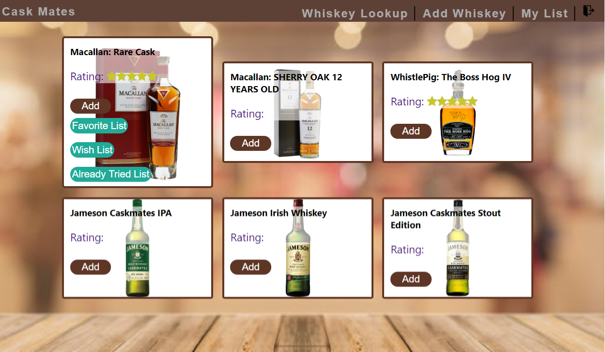
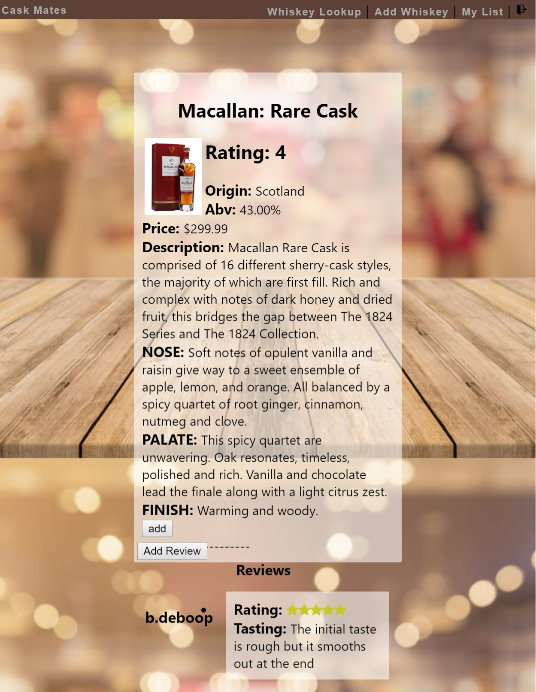
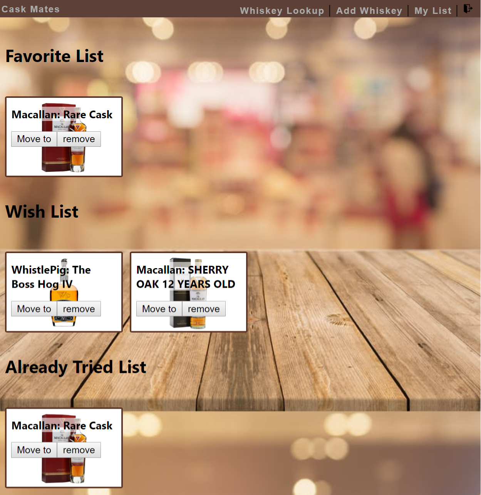

# Cask Mates Client
Cask Mates is interactive application where you can browse through a dataset of whiskeys and select specific whiskeys that tailor to your specific taste palates. Once you are able to find a whiskey that appeal to your taste buds you can add them to a choice of three list that can by your Favorites, Wish or Already Tried list.

 
 

### `Demo User`
Feel free to login with 
User: demouser
Password: password

### `Live App`
Open [Cask Mates](https://robinkhiv-caskmate-app.now.sh/login) to enjoy a live version of the app

### `Technologies Used`
HTML, CSS, React, Node, Express, and PostgreSQL

### `Application Programming Interface`
CaskMates is directed connected to a stand alone express server that is created specifically for this application.
Link to API
[Api github](https://github.com/RobinKhiv/Whis-Key-Server)
[Live Api](https://calm-anchorage-18074.herokuapp.com/api)

